# e2MDB

> Metadata and artwork for recordings, media files and Live TV/EPG on Enigma2 / OpenATV.

`e2MDB` combines an Enigma2 plugin with the separate `e2mdbd` backend service. The plugin integrates metadata into the receiver UI and collects Live/EPG candidates. The backend scans media folders, queries providers, downloads artwork, maintains the database and serves the web interface.

**User documentation:** [OpenATV e2MDB guide (English)](https://openatv.github.io/enigma2-doku/en/addons/e2mdb/)

## Features

- Scan recordings and media folders, with per-path content modes, exclusions and optional recursion.
- Read recording sidecars (`.meta`, `.eit`, `.cuts` and text descriptions) and derive search titles, season and episode hints from media filenames.
- Match movies, series and anime through configurable metadata providers.
- Cache metadata, posters, backdrops, title logos and episode images for reuse.
- Show enhanced Event Views for recordings and EPG events, with metadata integration for InfoBar, EPG and ChannelSelection.
- Queue missing Live/EPG metadata in the background and prefill future events for selected or frequently watched channels.
- Browse movies, series, seasons, episodes and cast in the web Media Browser; start and stop playback on the receiver.
- Inspect matches and alternatives in the web Editor, manage scan paths and monitor backend jobs, queues and database status.
- Run refresh, prefill, cleanup and SQLite maintenance through OpenATV scheduled tasks.

## Repository layout

The installable sources live under `src/`. Documentation screenshots in `assets/preview/` are separate from the plugin's runtime images.

```text
.
├── README.md
├── assets/
│   └── preview/                       # Receiver screenshots used in this README
├── CI/                                # Repository maintenance scripts
├── .github/workflows/                 # Compilation, linting and release automation
├── pyproject.toml                     # Ruff and isort configuration
└── src/
    ├── setup.py                       # Package and installation layout
    ├── setup_translate.py             # Translation build support
    ├── init.d/
    │   └── e2mdbd                     # Backend service script
    ├── Components/
    │   └── Converter/
    │       └── E2MDBEventInfo.py      # Enigma2 skin converter
    └── e2MDB/
        ├── __init__.py                # Version, translations and configuration
        ├── plugin.py                  # Plugin registration and receiver UI
        ├── e2mdbd.py                  # Backend daemon, jobs and web/API server
        ├── e2mdbctl.py                # Backend command-line client
        ├── E2MDBBackend*.py           # Backend config, database, scanning and bridges
        ├── E2MDBScanner.py            # Shared scanner/provider matching logic
        ├── E2MDBRecordingParser.py    # Recording sidecar parser
        ├── MediaNameParser.py         # Filename parsing
        ├── E2MDBDatabase.py           # GUI/shared database access and MediaDB
        ├── E2MDBProviders.py          # Provider orchestration
        ├── E2MDBEventView*.py         # Event Views and integration
        ├── E2MDBComponentMeta.py      # Metadata on Enigma2 sources
        ├── E2MDBLiveEPG.py            # Live/EPG metadata integration
        ├── E2MDBPrefill*.py           # Prefill configuration and candidate collection
        ├── E2MDBSchedulerTasks.py     # OpenATV task bridge
        ├── provider/                  # Metadata and artwork adapters
        ├── images/                    # Runtime artwork, masks and icons
        ├── locale/                    # Translation sources and compiled catalogs
        ├── web/
        │   └── index.html             # Editor, Media Browser and tools
        └── setup.xml                  # Receiver/OpenWebif settings
```

## Runtime and installation layout

The plugin targets the OpenATV Enigma2 environment and uses its screen classes, service references, EPG cache, configuration and FunctionTimer APIs. Skin integration depends on the metadata and service-list hooks available in the receiver image and on a compatible skin.

Python dependencies used by the source include `requests`, `Pillow`, `Twisted` and the standard-library `sqlite3` module. The repository's compilation workflow uses Python 3.13.

[Package configuration](src/setup.py) defines the following receiver layout:

| Source | Receiver destination |
|---|---|
| `src/e2MDB/` | `/usr/lib/enigma2/python/Plugins/Extensions/e2MDB/` |
| `src/Components/Converter/E2MDBEventInfo.py` | `/usr/lib/enigma2/python/Components/Converter/E2MDBEventInfo.py` |
| `src/init.d/e2mdbd` | `/etc/init.d/e2mdbd` |

The plugin package includes the provider adapters, channel mapping, web page, images, setup XML and compiled translations. The supplied init script starts `e2mdbd.pyc` from the installed plugin directory, so a source deployment must also provide that compiled entry point. Service registration and dependency installation belong to the receiver image/package integration.

### First setup on the receiver

The following steps provide a quick start. For the full user documentation, see the [OpenATV e2MDB guide](https://openatv.github.io/enigma2-doku/en/addons/e2mdb/).

1. Open **e2MDB** from the plugin browser and press **Menu** for settings.
2. Set the cache base path and provider search language. Enter personal API keys for enabled providers that require them, or disable those providers. Save the settings.
3. Return to the scanner and use **Green — Paths** to add media folders, select content modes and enable recursion where needed.
4. Select the paths to process and use **Blue — Start scan**. The scanner displays backend progress and allows the running scan to be stopped.
5. Open `http://<receiver-ip>:6066/` for the web interface. The port is configurable; when OpenWebif integration is available, its e2MDB entry redirects to this interface.

The backend service must be running for scans and the web interface. On an installed receiver, check it with:

```sh
/etc/init.d/e2mdbd status
```

The same service script accepts `start`, `stop` and `restart`.

## Architecture

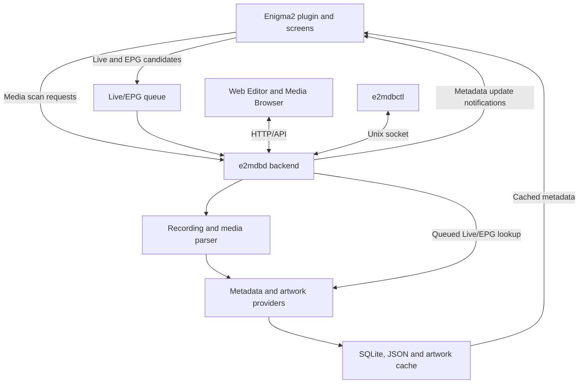

Provider requests and artwork processing run in the backend. Enigma2 collects events, displays cached results and receives update notifications. Scheduled prefill collects future EPG candidates in Enigma2; the backend processes the resulting queue.

| Module | Responsibility |
|---|---|
| [plugin.py](src/e2MDB/plugin.py) | Registration, scanner/setup screens, path selection, diagnostic tools, Event View hooks, OpenWebif link and playback bridge |
| [e2mdbd.py](src/e2MDB/e2mdbd.py) | Backend lifecycle, job queue, automatic Live/EPG worker, web/API server and command socket |
| [E2MDBBackendMetadataScanner.py](src/e2MDB/E2MDBBackendMetadataScanner.py) | Entry point for daemon scans, path filtering and recording/media parsing |
| [E2MDBRecordingParser.py](src/e2MDB/E2MDBRecordingParser.py), [MediaNameParser.py](src/e2MDB/MediaNameParser.py) | Recording sidecars and filename-derived title/episode information |
| [E2MDBBackendProvider.py](src/e2MDB/E2MDBBackendProvider.py), [E2MDBScanner.py](src/e2MDB/E2MDBScanner.py) | Provider enrichment and shared matching logic |
| [E2MDBBackendDatabase.py](src/e2MDB/E2MDBBackendDatabase.py) | Backend SQLite schema, media catalog, provider results/assets, Live/EPG queue and maintenance |
| [E2MDBDatabase.py](src/e2MDB/E2MDBDatabase.py) | GUI/shared database access and recording MediaDB support |
| [E2MDBProviders.py](src/e2MDB/E2MDBProviders.py), [provider/](src/e2MDB/provider/) | Metadata provider selection and adapters |
| [E2MDBHelper.py](src/e2MDB/E2MDBHelper.py), [E2MDBImageDownloader.py](src/e2MDB/E2MDBImageDownloader.py) | Cache paths, JSON and artwork helpers |
| [E2MDBComponentMeta.py](src/e2MDB/E2MDBComponentMeta.py), [E2MDBBackendNotify.py](src/e2MDB/E2MDBBackendNotify.py) | Metadata on Enigma2 sources and backend update notifications |
| [E2MDBEventInfo.py](src/Components/Converter/E2MDBEventInfo.py) | Skin access to metadata text, artwork paths and availability flags |
| [E2MDBBackendConfig.py](src/e2MDB/E2MDBBackendConfig.py), [E2MDBSchedulerTasks.py](src/e2MDB/E2MDBSchedulerTasks.py) | Persistent backend configuration and OpenATV task integration |

## Providers

The following roles reflect the adapters and settings in the current source:

| Provider | Use in e2MDB |
|---|---|
| TMDb | Movie and series metadata/artwork; personal API key |
| TVDb | Series and episode metadata/artwork; personal API key |
| OMDb | Optional metadata fallback; personal API key |
| TVmaze | Optional series fallback without a configured API key |
| Cinemeta | Optional movie/series fallback with English metadata |
| TVSpielfilm | Preferred metadata source for German Live/EPG |
| fernsehserien.de | German Live/EPG image fallback |
| Wikimedia / Wikipedia | Optional Live/EPG artwork fallback |
| AniList and Kitsu | Optional providers for Anime/Manga path modes |
| FanArt.tv | Artwork enrichment after a metadata match; personal API key |

TMDb, TVDb, TVSpielfilm and fernsehserien.de are enabled by default. The IMDb adapter remains in `provider/IMDB.py`, but is disabled in the current provider orchestration and setup.

## Configuration and scheduling

Receiver settings are defined in [__init__.py](src/e2MDB/__init__.py) under `config.plugins.e2mdb` and exposed through [setup.xml](src/e2MDB/setup.xml).

| Setting | Default | Purpose |
|---|---|---|
| `enableDatabase` | `True` | Database/cache integration |
| `cachePath` | `/media/hdd/` | Base directory; e2MDB appends `e2MDB/` |
| `webPort` | `6066` | Backend web interface port |
| `lang` | Receiver language, with English fallback | Provider search language |
| `showInMainMenu` | `False` | Optional main-menu entry |
| `scannerRescanExisting` | `False` | Reprocess existing media when enabled |
| `epgMetaEnabled` | `True` | Live/EPG metadata cache |
| `epgEventViewUseE2MDB`, `mediaEventViewUseE2MDB` | `True` | Enhanced Event Views |
| `epgInfoBarEnabled`, `epgChannelSelectionEnabled` | `True` | Live metadata integration |
| `epgRetentionDays` | `3` | Matched Live/EPG retention after an event ends |
| `epgNoMatchRetentionHours` | `1` | No-match Live/EPG retention after an event ends |
| `epgPrefillHorizonDays` | `2` | Future EPG horizon for prefill |

Saving the setup exports backend settings to `/etc/enigma2/e2mdb/settings.json` and requests a backend reload. Scan paths are stored in `paths.json`. Personal API keys are saved to `api_keys.json` on setup save and restored into plugin configuration at session start.

In the setup, **Yellow — Prefill channels** selects channels for prefill. **Blue — More...** opens queue diagnostics, retry of missing media metadata/artwork, database maintenance, manual prefill and ignore-pattern tools.

Planned runs use these entries in the OpenATV task/timer menu:

- **e2MDB Refresh**
- **e2MDB Live/EPG Prefill**
- **e2MDB Live/EPG Cleanup**
- **e2MDB SQLite Maintenance**

The daemon's separate scheduler has been removed. The automatic Live/EPG queue worker still runs in the backend.

## Storage

The default cache root is `/media/hdd/e2MDB`. Both [backend configuration](src/e2MDB/E2MDBBackendConfig.py) and [cache helpers](src/e2MDB/E2MDBHelper.py) derive it from `cachePath`. A base path of `/` resolves to `/e2MDB`.

| Location | Contents |
|---|---|
| `<cache>/results.db` | Central SQLite database for media, recording catalog, provider matches/assets, Live/EPG events, queue and backend state |
| `<cache>/media.db` | Recording MediaDB maintained by the scanner |
| `<cache>/data/` | Primary metadata JSON |
| `<cache>/results/` | Search results, recording catalog JSON and job history |
| `<cache>/series/`, `<cache>/seasons/`, `<cache>/index/` | Shared provider details, episode indexes and artwork |
| `<cache>/cover/`, `backdrop/`, `titlelogo/`, `image/`, `preview/` | Artwork cache directories |
| `/etc/enigma2/e2mdb/` | Persistent settings, API keys, scan paths, prefill/ignore configuration and scan/provider state |
| `/var/run/e2mdb/` | Runtime status, command/notification sockets and GUI requests |
| `/home/root/logs/e2MDB.log` | Plugin log when file logging is selected |
| `/home/root/logs/e2mdbd.log` | Backend output from the init service |

SQLite is central to the current backend and web interface. JSON metadata and cached artwork are also reused by the receiver UI.

Primary JSON and item-specific artwork paths use a hash of the reduced media path. Shared series/season data uses provider and ID directories:

```text
<cache>/data/<first-hash-char>/<hash>.json
<cache>/cover/<first-hash-char>/<hash>.<ext>
<cache>/image/<first-hash-char>/<hash>.<ext>
<cache>/series/<provider>/<id>/data.json
<cache>/series/<provider>/<id>/cover.<ext>
<cache>/index/<provider>/<id>/data.json
<cache>/seasons/<provider>/<id>/S01/data.json
```

## Backend diagnostics

[e2mdbctl.py](src/e2MDB/e2mdbctl.py) talks to the running backend through `/var/run/e2mdb/e2mdbd.sock`. From the installed plugin directory, useful read-only commands are:

```sh
cd /usr/lib/enigma2/python/Plugins/Extensions/e2MDB
python3 e2mdbctl.py status
python3 e2mdbctl.py media status
python3 e2mdbctl.py db status
python3 e2mdbctl.py live-queue status
python3 e2mdbctl.py jobs history
```

For packages that ship compiled Python files only, use `e2mdbctl.pyc` in place of `e2mdbctl.py`. Further commands for scans, metadata retries, cleanup and job control are listed in the client's `usage()` function.

## Screenshots

These screenshots show e2MDB on an OpenATV receiver. Layout, colors and the available channel-list views depend on the installed skin and its settings.

### Event View

Series episode details with title logos, artwork, descriptions, cast and episode information.

| 12 Monkeys | 24 |
|---|---|
| 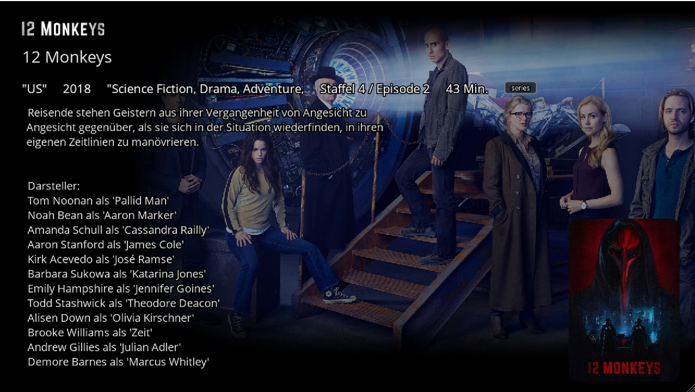 | 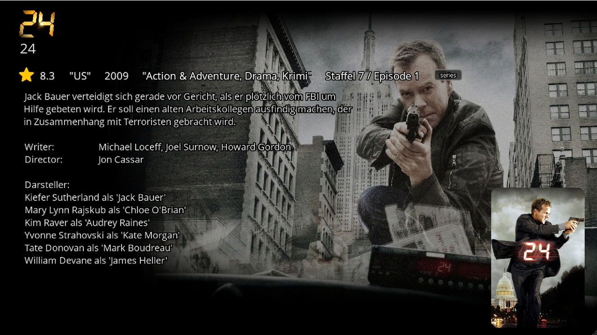 |

### Live TV and EPG

Program artwork in the InfoBar and artwork with the selected event's description in the graphical EPG.

| InfoBar | Graphical EPG |
|---|---|
| 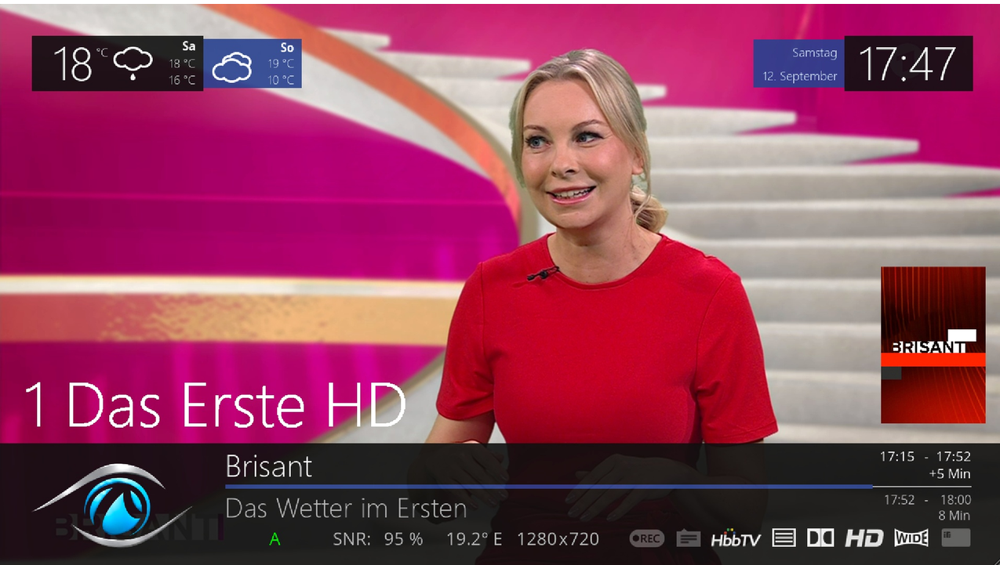 | 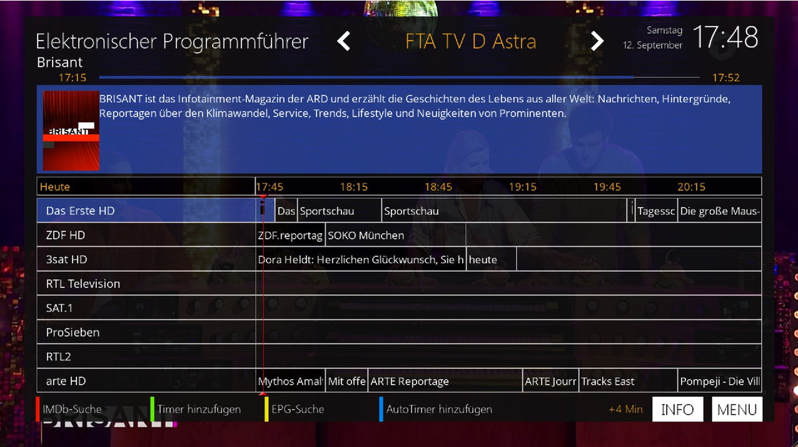 |

### Channel lists

Channel-list layouts can combine program artwork, event descriptions, progress indicators and upcoming programs. This full-width column view shows several channels side by side:

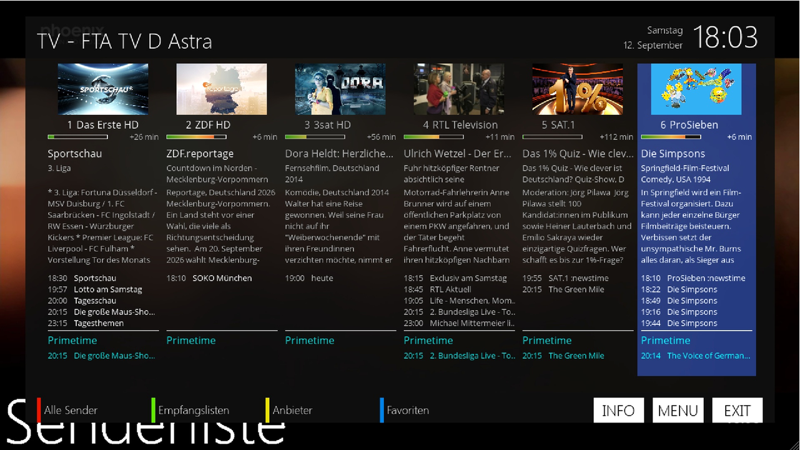

<details>
<summary>More channel-list layouts, including live TV preview</summary>

| Full-width rows with progress bars | Full-width rows with progress percentages |
|---|---|
| 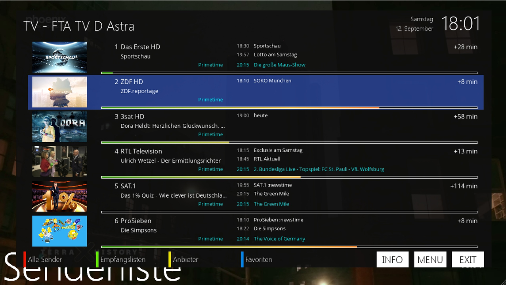 | 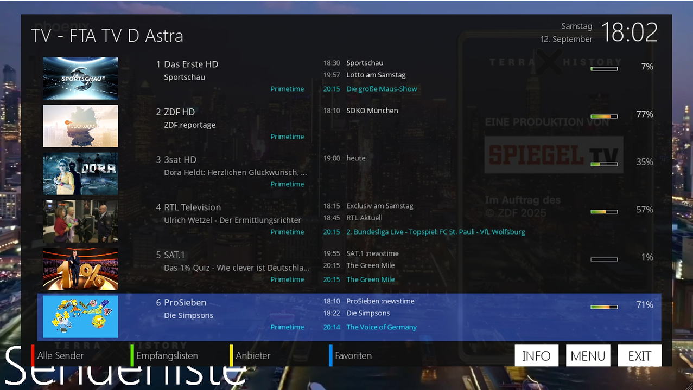 |

| Rows with live TV preview and progress bars | Rows with live TV preview and progress percentages |
|---|---|
| 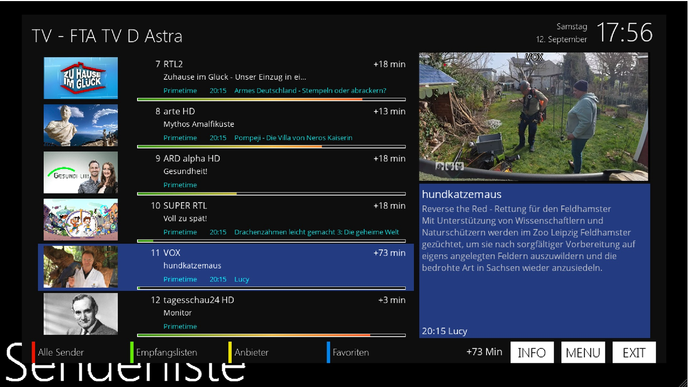 | 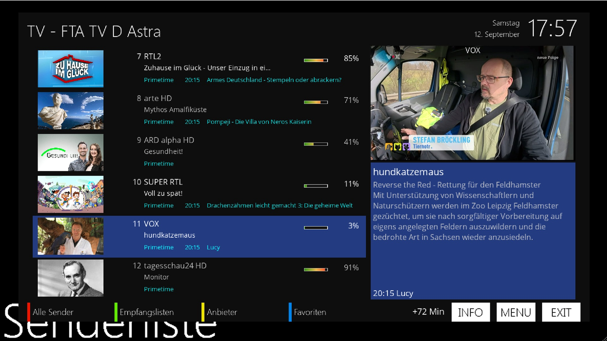 |

| Columns with live TV preview | Grid with live TV preview |
|---|---|
| 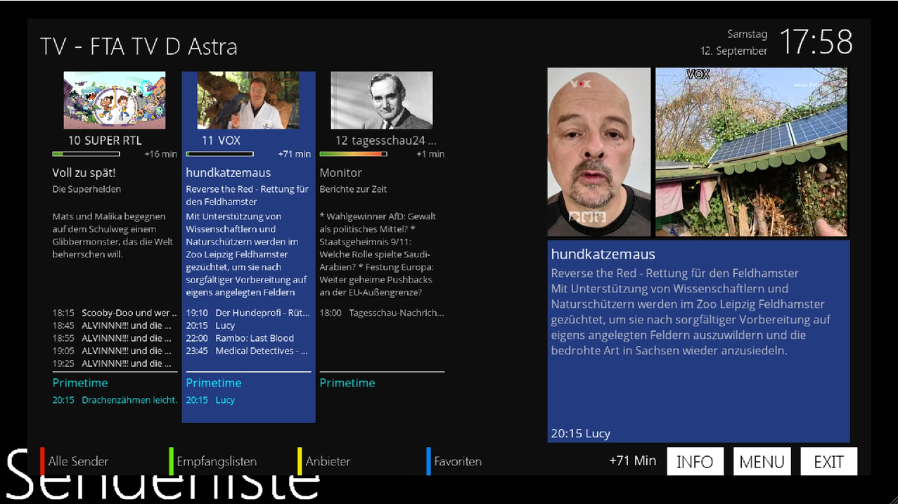 | 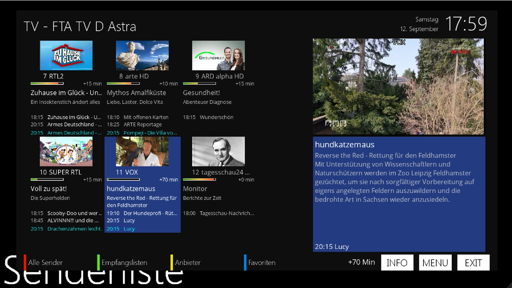 |

</details>

### Plugin menu and scanner

Open e2MDB from the extensions menu, then select media paths and start a backend scan.

| Extensions menu | e2MDB scanner |
|---|---|
| 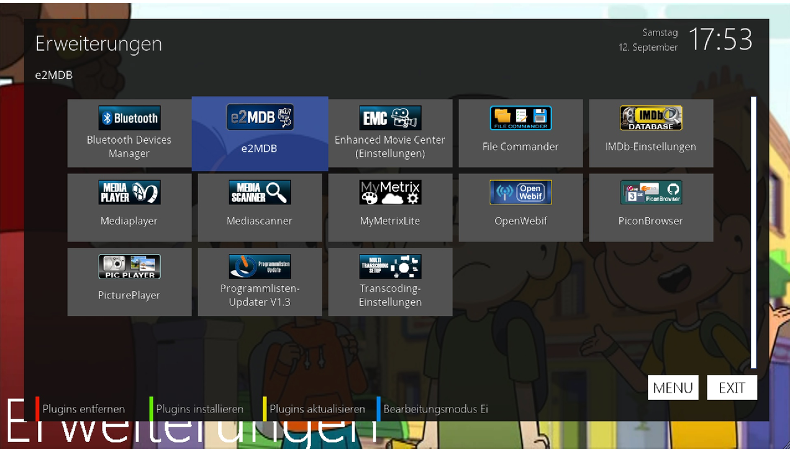 | 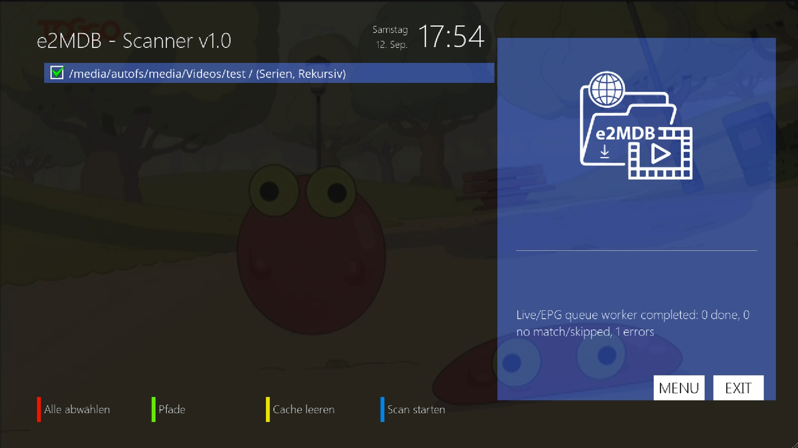 |

## Credits and source notices

Source headers credit Mr.Servo and jbleyel at OpenATV, with skin and design by stein17. Licensing notices are present in the individual source files.
