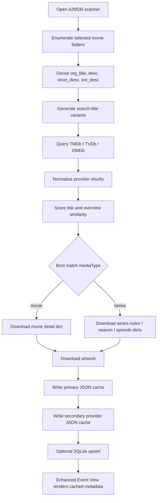

# e2MDB

> Enigma2 metadata plugin for recordings and external media files with multi-provider lookup, normalized cache data, artwork download, and an enhanced Event View UI.

## What this plugin does

`e2MDB` scans media entries from the Enigma2 movie area, derives one or more candidate titles from filename and service metadata, queries external providers, normalizes the returned data into a common schema, caches the result locally, and presents the cached metadata inside a custom event/info screen.

The implementation is centered around four subsystems:

1. **Enigma2 integration** via plugin registration, setup screen, movie-scanner UI, result UI, and event-view override.
2. **Metadata acquisition** via provider adapters for TMDb, TVDb, and OMDb.
3. **Normalization and persistence** via provider-neutral dictionaries, JSON cache files, downloaded artwork, and optional SQLite indexing.
4. **Presentation** via a skin-driven event view that renders title, runtime, genres, cast, crew, poster, backdrop, still image, and title logos.

---

## Feature highlights

- Scans Enigma2 movie folders and subfolders.
- Supports both native recordings and foreign/container video files.
- Generates multiple search-title variants from filenames and metadata.
- Tries to classify content as **movie** or **series**.
- Extracts season and episode hints from names and descriptions.
- Queries multiple online providers and merges the best match.
- Downloads and caches cover, backdrop, title-logo, and still images.
- Stores normalized JSON data for later reuse.
- Optionally writes file-level scan data into SQLite.
- Replaces the default Event Information dialog when metadata is already cached.

---

## Repository layout

```text
.
├── __init__.py
├── plugin.py
├── e2MDBProviders.py
├── e2MDBDatabase.py
├── provider/
│   ├── TMDB.py
│   ├── TVDB.py
│   └── OMDB.py
├── images/
│   ├── mask_l.png
│   ├── mask_l_inverted.png
│   ├── rt59.png
│   ├── rt60.png
│   └── star.png
├── locale/
│   ├── de.po
│   ├── e2MDB.pot
│   ├── updatepot.sh
│   └── xml2po.py
└── setup.xml
```

---

## Quick architecture summary

### Main modules

| Module | Responsibility |
|---|---|
| `__init__.py` | globals, locale setup, config keys, API-key access, logging |
| `plugin.py` | scanner pipeline, cache handling, UI screens, image download, event-view override |
| `e2MDBProviders.py` | provider orchestration and search-order handling |
| `e2MDBDatabase.py` | optional SQLite upsert/search/delete support |
| `provider/TMDB.py` | TMDb adapter and normalization |
| `provider/TVDB.py` | TVDb adapter and normalization |
| `provider/OMDB.py` | OMDb adapter and normalization |

### Main runtime flow



---

## Installation and expected runtime context

This project is written for **Enigma2** and expects the classic plugin runtime environment, including Enigma2 screen classes, service references, plugin descriptors, and the movie-selection subsystem.

The code also depends on:

- `requests`
- `Pillow`
- SQLite via Python stdlib
- Enigma2 Python modules and UI classes

The cache and database default to storage below `/media/hdd/`.

---

## Configuration

The plugin stores its configuration under `config.plugins.e2mdb`.

| Key | Type | Meaning |
|---|---|---|
| `tmdbactive` | `ConfigYesNo` | enables TMDb |
| `tmdbapikey` | `ConfigText` | TMDb API key |
| `tvdbactive` | `ConfigYesNo` | enables TVDb |
| `tvdbapikey` | `ConfigText` | TVDb API key |
| `omdbactive` | `ConfigYesNo` | enables OMDb |
| `omdbapikey` | `ConfigText` | OMDb API key |
| `cache_path` | `ConfigText` | cache root prefix |
| `database_path` | `ConfigText` | SQLite root prefix |
| `enableDatabase` | `ConfigYesNo` | enables optional media DB |

### Effective cache root

- Default: `/media/hdd/e2MDB`
- Special fallback when `cache_path == "/"`: `/tmp/e2MDB`

---

## Documentation split

This repository is best documented with a short project-level README and deeper technical documentation in `docs/`.

- [Architecture and internals](docs/ARCHITECTURE.md)
- [Normalized data schemas](docs/DATA-SCHEMA.md)

---

## Visual examples

These preview images show the kind of Event View result a matching skin can render when the plugin has already cached metadata and images.

> Put the image files into `assets/preview/` in your GitHub repository and keep the filenames used below.

### Example 1: Movie


### Example 2: Series episode


### Example 3: Movie


### Example 4: Movie


---

## Cache layout at a glance

The plugin uses deterministic file paths derived either from the original media path or from provider identifiers.

### Primary cache

Primary data is keyed by a hash of the reduced original media path.

```text
<cache>/data/<first-hash-char>/<full-hash>.json
<cache>/cover/<first-hash-char>/<full-hash>.<ext>
<cache>/backdrop/<first-hash-char>/<full-hash>.<ext>
<cache>/titlelogo/<first-hash-char>/<full-hash>.<ext>
<cache>/image/<first-hash-char>/<full-hash>.<ext>
```

### Secondary cache

Secondary data is keyed by provider name and provider ID.

```text
<cache>/series/<provider>_<id>.json
<cache>/index/<provider>_<id>.json
<cache>/season/<provider>_<id>/S01.json
<cache>/series/<provider>_<id>.cover.jpg
<cache>/series/<provider>_<id>.backdrop.jpg
```

---

## Public plugin entry points

The plugin registers three integration points:

- `WHERE_PLUGINMENU`
- `WHERE_MENU`
- `WHERE_SESSIONSTART`

At session start it monkey-patches `MovieSelection.showEventInformation` so the custom `e2MDBEventViewSimple` screen is opened whenever a primary cache JSON file exists for the selected media item.

---

## SQLite support

When enabled, the plugin creates `e2MDB/e2MDB.db` below the configured database root and upserts one row per media path.

Tracked fields include:

- `path`
- `name`
- `ref`
- `title`
- `short`
- `extended`
- `tags`
- `duration`
- `begin`
- `size`

This DB is useful as an auxiliary media index. It is not the primary metadata source for the Event View; JSON cache files are.

---

## Known technical observations

These are worth calling out if the project is published or continued:

- The code contains several naming inconsistencies and probable dead paths, especially in the SQLite helper.
- `e2MDBDatabase.py` mixes `extended`/`extDesc` naming and calls `_getTitles()` although the implemented helper is `_get_titles()`.
- `writeJsonFile()` currently logs exceptions but does not return a structured status value, while some callers treat it as if it returned one.
- A few path and comment descriptions are slightly inconsistent with actual method behavior.
- The plugin header contains licensing wording that should be reviewed before public GitHub publication.

These observations do not prevent the documentation from being useful, but they should be reviewed before declaring the implementation production-ready.

---

## Recommended GitHub structure

```text
.
├── README.md
├── docs/
│   ├── ARCHITECTURE.md
│   └── DATA-SCHEMA.md
└── assets/
    └── preview/
        ├── airplane.png
        ├── inga-lindstrom.png
        ├── mission-to-mars.png
        └── hatari.png
```

---

## License note

The source header states GPL-3.0-related wording, but it also includes additional non-commercial and advertising restrictions. Those restrictions are generally not compatible with plain GPL wording. Before publishing the repository, the project should use one clear, legally consistent license statement.
